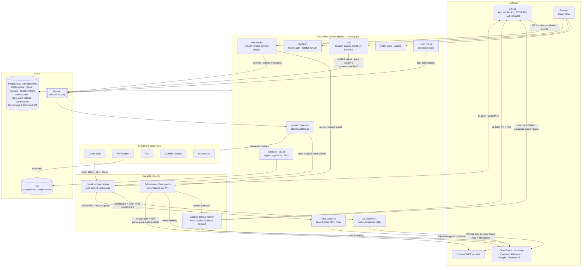
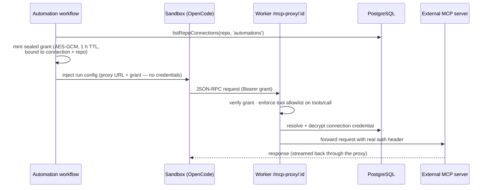

# Turbodiff


The open-source, composable software factory: agents that can help at any
contiguous part of delivery, from a free-form idea to an open pull request,
from an existing pull request to a review, or all the way to a merged and
verified change. Turbodiff fits into a team's existing process instead of
requiring the team to replace it. It is a GitHub App hosted end-to-end on
Cloudflare (Workers, Durable Objects, Hyperdrive, Queues, Containers, R2) and
built with [Flue](https://flueframework.com).

Choose where Turbodiff starts, where it stops, and which stages require a
person. The target lifecycle covers planning, implementation, publication,
review, repair, verification, and merge. Each stage produces durable artifacts
that can be handed back to the team or used to continue an automated run.

**Live at [turbodiff.dev](https://turbodiff.dev)** — or self-host on your own
Cloudflare account ([One-time setup](#one-time-setup)).

> [!WARNING]
> **Turbodiff is under heavy development.** Expect rough edges, bugs, and
> breaking changes between releases. If something misbehaves, please
> [open an issue](https://github.com/Ngineer101/turbodiff/issues) — and
> contributions are very welcome: pull requests, bug reports, and ideas all
> help. If you want to work on something bigger, open an issue first so we can
> align on the approach.

## What's inside

**Factory** (in active development — see the
[composable lifecycle specification](docs/software-factory-lifecycle.md)):

- **Plan** — an agent clones the repo read-only, analyzes your requirements
  against the real code, asks clarifying questions, and produces a file-level
  plan plus machine-checkable acceptance criteria for you to approve.
- **Generate** — an agent implements the approved plan in a sandbox, a
  per-repo check command gates the push, and a PR opens.
- **Auto-fix** — a blocking review dispatches a fix agent (max 3 attempts per
  PR, then a human-handoff comment).
- **Verify** — every acceptance criterion is checked empirically against the
  branch: static criteria by reading the tree, runtime criteria by launching
  the app in the sandbox, visual criteria by driving headless Chrome. The PR
  gets a report comment with a verdict table and inline screenshots; unmet
  criteria feed the auto-fix loop.

**Review** (where Turbodiff started; also works standalone for existing
changes through on-demand or automatic repository intake):

- One durable agent instance per PR (`owner--repo--number`), so re-reviews
  continue the same conversation and reconcile against earlier findings.
- Risk tiering sizes the effort: trivial changes get one generalist agent,
  large or sensitive changes the full agent fleet. A push to a reviewed PR is
  tiered on what changed since the last review, waits out a per-repo quiet
  window (a newer push supersedes it), and re-runs only the agents it
  concerns: those that requested changes, and approvers whose flagged files
  it touches.
- Optional blocking mode: a P1 finding posts `REQUEST_CHANGES`, a clean review
  approves. Approval is coverage-gated: the reviewer receives a complete
  changed-file manifest, fetches omitted patches in bounded packets, and must
  account for every reviewable file before Turbodiff can approve.
- Custom review agents (personas) per installation, with optional remote
  [MCP](https://modelcontextprotocol.io) tool connections (bearer tokens
  encrypted at rest; servers are treated as untrusted, like the PR itself).

Coding runs execute inside Cloudflare Containers with a pinned OpenCode
harness. Any tool-capable LLM in the Cloudflare AI Gateway catalog can be a
runner model; authentication, billing, retries, and observability stay
centralized in Cloudflare. The operator-managed `app.models` table is the sole
runner catalog: its `runner_default` and `runner_fast_default` roles select the
normal and low-cost models, with no hard-coded application fallback.

## Architecture

Everything runs in one Cloudflare Worker deployment: an HTTP layer (Hono)
in front of Durable Objects for the long-lived pieces (the per-PR review
agent, the sandbox container), Cloudflare Workflows for the multi-minute
factory runs, a queue to decouple intake from execution, PostgreSQL through
Hyperdrive for relational state, and R2 for artifacts.



### MCP connections (repo-scoped)

MCP servers are registered once per installation on the integrations page and
attached to **repositories** (`repo_connections`), with independent toggles
for the two mount contexts: hosted PR reviews and sandbox automation runs.
Credentials are sealed (AES-256-GCM) in PostgreSQL and never leave the Worker
boundary. Hosted reviews mount connections directly — the agent's auth
resolver decrypts per request. Sandbox runs can't be trusted with
credentials (they execute repo-influenced code), so they get a relay instead:



A prompt-injected repository can therefore at worst _use_ an attached
connection for the lifetime of one run's grant — it can never read the
credential itself, and calls outside the connection's tool allowlist are
rejected at the proxy.

## Code map

- [src/ai/agents/pr-reviewer.ts](src/ai/agents/pr-reviewer.ts) — the review agent.
- [src/ai/tools/github.ts](src/ai/tools/github.ts) — its tools (`fetch_pr`,
  `fetch_diff`, `fetch_file`, `fetch_review_threads`, `post_review`).
- [docs/review-quality.md](docs/review-quality.md) — review context, evidence,
  publication, evaluation, and model-experimentation contracts.
- [src/ai/runners/planner.ts](src/ai/runners/planner.ts) /
  [generation workflow](src/ai/workflows/generation.ts) /
  [fixer.ts](src/ai/runners/fixer.ts) /
  [verifier.ts](src/ai/runners/verifier.ts) — the factory pipeline stages, each a
  sandboxed agent run.
- [src/ai/runtime/coding-agent.ts](src/ai/runtime/coding-agent.ts) and
  [src/services/ai-gateway-proxy.ts](src/services/ai-gateway-proxy.ts) — the
  shared OpenCode execution seam and capability-authenticated model relay.
- [src/cloudflare.ts](src/cloudflare.ts) — the factory queue consumer and the
  sandbox container export.
- [src/http/webhooks.ts](src/http/webhooks.ts) and
  [src/services/github-webhooks.ts](src/services/github-webhooks.ts) — GitHub App webhooks:
  installation sync, review auto-dispatch, auto-fix trigger.
- [src/http/api.ts](src/http/api.ts) — the signed-in JSON API for the dashboard,
  factory, reviews, agents, integrations, and per-repo settings.
- [src/app.ts](src/app.ts) — the HTTP composition root; operator endpoints live
  in [src/http/internal.ts](src/http/internal.ts).
- [docs/architecture.md](docs/architecture.md) — layer boundaries and dependency rules.
- [docs/coding-harness.md](docs/coding-harness.md) — the model-neutral OpenCode
  runtime, security boundary, compatibility rules, and benchmark plan.
- [docs/code-editing.md](docs/code-editing.md) — the in-browser code viewer/editor
  and how the GitHub and Artifacts storage backends differ.
- [db/migrations/](db/migrations/) — PostgreSQL schemas for identity,
  installations, repositories, reviews, agents, factory state, and collaboration.

## One-time setup

Everything runs on a single Cloudflare account. To self-host, create your own
GitHub App and deploy:

1. **Dependencies**:

   ```sh
   vp install
   ```

2. **AI Gateway** — set `AI_GATEWAY_ID` and `AI_GATEWAY_ACCOUNT_ID` in
   [wrangler.jsonc](wrangler.jsonc). Enable Unified Billing for third-party
   models and ensure the account has sufficient credits. Runner model ids use
   Cloudflare's canonical REST form: `provider/model` for third-party models
   (for example `openai/gpt-5.5`) and `@cf/author/model` for Workers AI (for
   example `@cf/moonshotai/kimi-k2.6`).

3. **PostgreSQL + Hyperdrive** — provision PostgreSQL, create a Hyperdrive
   configuration with caching disabled, put its id in
   [wrangler.jsonc](wrangler.jsonc), and apply the schema through the direct
   database URL:

   ```sh
   export DATABASE_URL='postgres://...'
   vp run db:migrate
   vp run db:verify
   ```

   See [docs/postgres.md](docs/postgres.md) for local Docker, database roles,
   Hyperdrive creation, and deployment details.

4. **Queue and R2 bucket** (factory pipeline):

   ```sh
   npx wrangler queues create turbodiff-factory
   npx wrangler r2 bucket create turbodiff-artifacts
   ```

5. **GitHub App** — create one at <https://github.com/settings/apps>:
   - **Webhook URL**: `https://<your-worker>/webhooks/github`, with a secret
     (`openssl rand -hex 32`).
   - **Repository permissions**: Contents (read & write — the fix and
     generation agents push branches), Pull requests (read & write), Issues
     (read & write, for comment reactions and factory reports), Actions
     (read — CI-failure auto-fix reads workflow run status and job logs).
   - **Subscribe to events**: Pull request, Pull request review, Issue comment,
     Repository, Workflow run.
   - **Callback URL**: `https://<your-worker>/auth/callback`; note the OAuth
     client id and generate a client secret.
   - Generate a **private key** and convert it to PKCS#8 (WebCrypto can't read
     GitHub's PKCS#1 file):

     ```sh
     openssl pkcs8 -topk8 -inform PEM -outform PEM -nocrypt -in app.pem -out app.pkcs8.pem
     ```

   - Set `GITHUB_APP_SLUG` in [wrangler.jsonc](wrangler.jsonc).
   - Existing installations: accept the new Actions permission and Workflow
     run event subscription in GitHub's UI to start receiving `workflow_run`
     deliveries — this is a one-time manual step per installation, not
     something a code deploy alone covers.

6. **Secrets** — locally in `.dev.vars`; in production:

   ```sh
   npx wrangler secret put GITHUB_APP_ID
   npx wrangler secret put GITHUB_APP_PRIVATE_KEY   # the PKCS#8 PEM, whole file
   npx wrangler secret put GITHUB_WEBHOOK_SECRET
   npx wrangler secret put GITHUB_OAUTH_CLIENT_ID
   npx wrangler secret put GITHUB_OAUTH_CLIENT_SECRET
   npx wrangler secret put SESSION_SECRET           # openssl rand -hex 32
   npx wrangler secret put REVIEW_SECRET            # openssl rand -hex 32 (operator endpoints)
   # Factory coding runs — Account / Workers AI / Read permission:
   npx wrangler secret put AI_GATEWAY_API_TOKEN
   # Only if agents use authenticated external MCP connections:
   npx wrangler secret put TOKEN_ENCRYPTION_KEY     # openssl rand -hex 32
   # Only if you use org member invites (Settings > Members on an org installation):
   npx wrangler secret put RESEND_API_KEY           # from resend.com; pair with RESEND_FROM_ADDRESS var
   # Only for the skills.sh catalog browser on the Skills page (a Vercel OIDC
   # token, see https://www.skills.sh/docs/api); without it the catalog shows
   # as unconfigured and importing by GitHub URL still works:
   npx wrangler secret put SKILLS_SH_API_TOKEN
   # Only for Web Push notifications (see below):
   npx wrangler secret put VAPID_PUBLIC_KEY
   npx wrangler secret put VAPID_PRIVATE_KEY
   npx wrangler secret put VAPID_SUBJECT            # mailto:you@example.com
   ```

   **Web Push (optional).** The Settings page can enable browser push
   notifications for factory tasks that need your input. Without the three
   VAPID secrets the toggle shows as unavailable; everything else works.
   Generate a keypair (ECDSA P-256, in the exact base64url encodings the
   push library expects):

   ```sh
   node -e "const{subtle}=require('node:crypto').webcrypto;subtle.generateKey({name:'ECDSA',namedCurve:'P-256'},true,['sign','verify']).then(async kp=>{const raw=Buffer.from(await subtle.exportKey('raw',kp.publicKey));const jwk=await subtle.exportKey('jwk',kp.privateKey);console.log('VAPID_PUBLIC_KEY='+raw.toString('base64url'));console.log('VAPID_PRIVATE_KEY='+jwk.d)})"
   ```

   Set both halves from the same run — a mismatched pair fails only at send
   time (silent 403s from the push service), not at subscribe time.
   `VAPID_SUBJECT` is a `mailto:` address push services can use to contact
   you. All three are secrets — including the public key, which isn't
   confidential but must differ per deployment: subscriptions are pinned to
   the key browsers subscribed with, so a key committed to the repo would
   break push for every fork (and rotating it later invalidates existing
   subscriptions until users re-toggle notifications).

7. **Custom domain** (optional) — add it to the Worker, set `PUBLIC_BASE_URL`
   in [wrangler.jsonc](wrangler.jsonc), and update the GitHub App's webhook +
   callback URLs.

## Environment reference

Turbodiff has three configuration scopes. Non-secret Worker variables belong
in `wrangler.jsonc`; Worker secrets belong in the deployed secret store and in
the ignored `.dev.vars` file for local development; database and deployment
variables belong only in the shell or GitHub Actions. Cloudflare recommends
using either `.dev.vars` or `.env`, not both—when `.dev.vars` exists, `.env`
files are not merged into the local Worker environment. See Cloudflare's
[environment-variable and secret documentation](https://developers.cloudflare.com/workers/local-development/environment-variables/).

### Worker variables

These are non-secret values under `vars` in `wrangler.jsonc`:

| Name                    | Required                   | Purpose                                                                                                 |
| ----------------------- | -------------------------- | ------------------------------------------------------------------------------------------------------- |
| `AI_GATEWAY_ID`         | Yes                        | Name of the AI Gateway used by hosted agents and the sandbox model relay.                               |
| `AI_GATEWAY_ACCOUNT_ID` | For sandbox coding runs    | Cloudflare account containing the Gateway.                                                              |
| `PUBLIC_BASE_URL`       | Yes                        | Canonical deployment origin used for OAuth callbacks, proxy URLs, task links, and signed artifact URLs. |
| `GITHUB_APP_SLUG`       | For GitHub repos           | GitHub App URL slug and bot login prefix.                                                               |
| `ARTIFACTS_REMOTE_BASE` | For hosted Artifacts repos | Git smart-HTTP base URL for the configured Artifacts namespace.                                         |
| `RESEND_FROM_ADDRESS`   | With email invites         | Sender address on a Resend-verified domain.                                                             |
| `REVIEW_DAILY_LIMIT`    | No; defaults to `50`       | Maximum automatic reviews per installation in a rolling 24-hour window.                                 |
| `TRIVIAL_MODEL`         | No                         | Canonical model id used for trivial PRs; an empty value disables the override.                          |

### Worker secrets

Production values are created with `wrangler secret put <NAME>`. Local values
go in `.dev.vars`, which is gitignored.

| Name                         | Required                          | Purpose                                                                                                                         |
| ---------------------------- | --------------------------------- | ------------------------------------------------------------------------------------------------------------------------------- |
| `GITHUB_APP_ID`              | For GitHub repos                  | Numeric GitHub App id used to issue installation tokens.                                                                        |
| `GITHUB_APP_PRIVATE_KEY`     | For GitHub repos                  | PKCS#8 PEM private key used to sign GitHub App JWTs.                                                                            |
| `GITHUB_WEBHOOK_SECRET`      | For GitHub repos                  | HMAC secret used to authenticate webhook deliveries.                                                                            |
| `GITHUB_OAUTH_CLIENT_ID`     | For GitHub sign-in                | OAuth application client id.                                                                                                    |
| `GITHUB_OAUTH_CLIENT_SECRET` | For GitHub sign-in                | OAuth application client secret.                                                                                                |
| `SESSION_SECRET`             | Yes                               | Signs authentication state, MCP OAuth state, and artifact capabilities; use at least 32 random bytes.                           |
| `REVIEW_SECRET`              | Yes for operator APIs             | Bearer secret protecting `/internal/*` and manual review endpoints.                                                             |
| `AI_GATEWAY_API_TOKEN`       | For sandbox coding runs           | Worker-only Cloudflare token with `Account / Workers AI / Read`; it never enters the sandbox.                                   |
| `TOKEN_ENCRYPTION_KEY`       | For authenticated MCP connections | Exactly 64 hexadecimal characters (`openssl rand -hex 32`) used for AES-GCM credential encryption and relay grants.             |
| `RESEND_API_KEY`             | For email invites                 | Resend API key; pair it with `RESEND_FROM_ADDRESS`.                                                                             |
| `SKILLS_SH_API_TOKEN`        | For catalog browsing              | Vercel OIDC token for the skills.sh catalog; direct GitHub imports work without it.                                             |
| `VAPID_PUBLIC_KEY`           | For Web Push                      | Base64url uncompressed P-256 public point. Public by protocol, but stored as a secret so each deployment keeps its own keypair. |
| `VAPID_PRIVATE_KEY`          | For Web Push                      | Base64url P-256 private scalar paired with `VAPID_PUBLIC_KEY`.                                                                  |
| `VAPID_SUBJECT`              | For Web Push                      | Contact URI for the application server, normally `mailto:you@example.com`.                                                      |

The three `VAPID_*` values are an optional set and must be configured together.
Without `VAPID_PUBLIC_KEY`, the UI disables browser subscriptions; a partial
configuration can fail later while sending. The rest of Turbodiff continues
to work without Web Push. Generate the keypair with the command in the setup
section above, keep it stable within an environment, and use distinct pairs
between local, staging, and production environments.

### Local `.dev.vars` template

The current `.dev.vars` file is not generated, so optional keys do not appear
until you add them. This template contains every Worker secret, the local-only
login value, and the common local overrides. Leave an optional integration
blank when you do not use it. Never commit this file.

```dotenv
# GitHub App and authentication
GITHUB_APP_ID=""
GITHUB_APP_PRIVATE_KEY=""
GITHUB_WEBHOOK_SECRET=""
GITHUB_OAUTH_CLIENT_ID=""
GITHUB_OAUTH_CLIENT_SECRET=""
SESSION_SECRET=""
REVIEW_SECRET=""

# Sandbox coding models
AI_GATEWAY_API_TOKEN=""

# Optional integrations
TOKEN_ENCRYPTION_KEY=""
RESEND_API_KEY=""
SKILLS_SH_API_TOKEN=""

# Optional Web Push — configure all three or none
VAPID_PUBLIC_KEY=""
VAPID_PRIVATE_KEY=""
VAPID_SUBJECT="mailto:you@example.com"

# Local-only login: comma-separated installation ids
DEV_FAKE_INSTALLATIONS=""

# Optional local overrides for values otherwise read from wrangler.jsonc
AI_GATEWAY_ACCOUNT_ID=""
PUBLIC_BASE_URL="http://localhost:5173"
```

`DEV_FAKE_INSTALLATIONS` must never be deployed. Use the URL printed by the
development server if it differs from the example `PUBLIC_BASE_URL`.

### Shell and CI variables

These configure tooling, not the running Worker:

| Name                      | Scope                 | Purpose                                                                                                 |
| ------------------------- | --------------------- | ------------------------------------------------------------------------------------------------------- |
| `DATABASE_URL`            | Local shell / CI job  | Direct PostgreSQL URL used by migration, schema verification, and Worker integration-test commands.     |
| `HYPERDRIVE_DATABASE_URL` | Local shell helper    | Direct database URL passed to Wrangler while creating or updating Hyperdrive; the app does not read it. |
| `POSTGRES_DATABASE_URL`   | GitHub Actions secret | Production migration-role URL, mapped to `DATABASE_URL` by the deploy workflow.                         |
| `CLOUDFLARE_API_TOKEN`    | GitHub Actions secret | Credential used by Wrangler to validate and deploy the Worker and container.                            |
| `CLOUDFLARE_ACCOUNT_ID`   | GitHub Actions secret | Cloudflare account targeted by the deployment workflow.                                                 |

Cloudflare bindings—including `AI`, `HYPERDRIVE`, `ARTIFACTS`,
`GIT_ARTIFACTS`, `FACTORY_QUEUE`, Durable Objects, Workflows, assets, and
version metadata—are configured structurally in `wrangler.jsonc`; they are not
`.dev.vars` entries. Likewise, `GIT_TOKEN`, `GIT_REMOTE`, and `TURBODIFF_*`
values are short-lived variables injected internally into sandbox commands and
must not be configured by an operator. `PUPPETEER_EXECUTABLE_PATH` and
`NODE_PATH` are fixed inside the sandbox image for browser verification and are
also not deployment inputs.

## Develop

Local dev needs **Docker running** (the sandbox container image builds on
first start).

```sh
npm run dev
```

To exercise webhooks locally, use a tunnel (`cloudflared tunnel`, `smee.io`)
pointed at `/webhooks/github`, or send signed test payloads (HMAC-SHA256 of the
body in `x-hub-signature-256: sha256=<hex>`).

> Vite+ owns the package-manager and Node versions for this repository; use
> the `vp` commands documented in [AGENTS.md](AGENTS.md).

## Deploy

Every commit to `main` deploys automatically via
[GitHub Actions](.github/workflows/deploy.yml). The workflow applies and
verifies migrations on the existing PlanetScale database, then deploys the
Worker and sandbox container image. It does not provision PlanetScale or
Hyperdrive. The workflow needs `POSTGRES_DATABASE_URL`,
`CLOUDFLARE_API_TOKEN` (Workers Scripts:Edit, Containers:Edit), and
`CLOUDFLARE_ACCOUNT_ID`. Pull requests run the same validation, integration,
build, and Wrangler dry-run gates in [CI](.github/workflows/ci.yml), but are
not deployed.

To deploy manually (Docker required):

```sh
vp run deploy
```

## Use it

1. Install the GitHub App, selecting the repositories it may work on.
2. Sign in — the board at `/` is the factory: add a todo, start it, answer
   the planning agent's questions, approve the plan, and follow the generated
   PR through review, auto-fix, and verification in the cockpit.
3. Every pull request — yours or the factory's — gets an automatic review
   (capped per installation per day via `REVIEW_DAILY_LIMIT`); recent reviews
   and costs are on `/usage`.
4. Configure per-repo behavior on `/settings`: the factory toggle, re-review
   on push (with its quiet window in minutes), blocking reviews, auto-fix,
   auto-merge, demo videos, and the sandbox check command.

Operator endpoints (Bearer `REVIEW_SECRET`) mirror the UI for automation:
`POST /review` (manual re-review), `POST /internal/generate`,
`POST /internal/plans` + `/answers` + `/approve`, `POST /internal/fix`, and
`GET /internal/pr-reviewer/<owner--repo--number>` to inspect a review agent's
conversation.

## License

Turbodiff is licensed under the [Functional Source License, Version 1.1, ALv2
Future License](LICENSE.md) (FSL-1.1-ALv2): use, modify, and self-host freely —
including inside your company — but don't offer it (or a substantially similar
service) commercially in competition with Turbodiff. Each release becomes
Apache 2.0 two years after publication. See [fsl.software](https://fsl.software).
