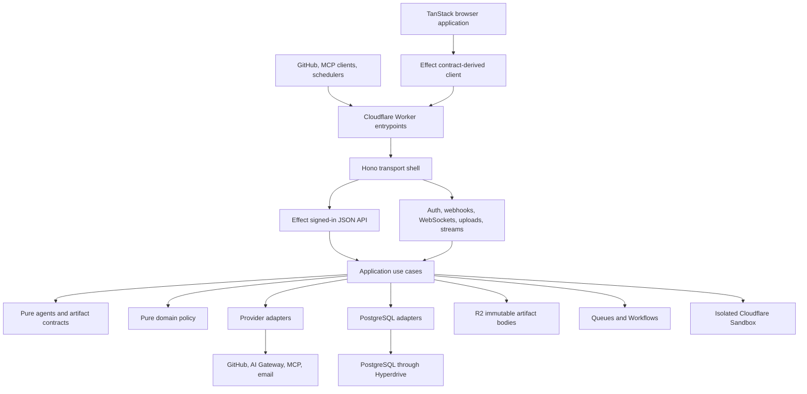
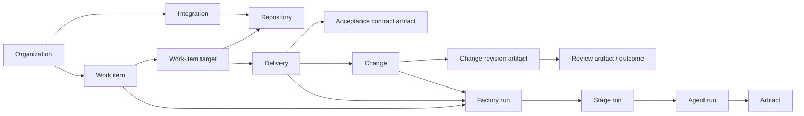

# Turbodiff architecture

The product model starts with a small set of primitives; Effect, Hono, PostgreSQL, Cloudflare services, and provider SDKs exist only to implement those primitives.

The rules that shape every change are:

- Better Auth organizations are tenant roots. GitHub installations are integrations.
- Agents are pure definitions. They do not own persistence, queues, providers, publication, or orchestration.
- Agent inputs and outputs are immutable artifacts.
- Factory execution is explicit and versioned: `factory_run → stage_run → agent_run` with append-only lifecycle events.
- Ordinary signed-in JSON endpoints belong to one Effect API contract and one generated client.
- Reusable use cases belong in `application`, provider mechanics in `integrations`, and SQL in `data`.
- Queue messages contain durable identifiers, never duplicated business payloads.

## System shape

Dependencies point inward from transports and providers toward application logic and pure definitions.



Effect is an application-edge architecture, not the domain model. The API uses Effect for typed endpoints, middleware, dependency wiring, and expected failures. Pure agents and artifact contracts use Zod. Provider inputs are parsed at their boundary. The domain remains ordinary, side-effect-free TypeScript.

## Product primitives

Turbodiff has six product primitives. Product pages and database projections may combine them, but should not introduce competing execution concepts.

### Agent

An agent is a pure TypeScript definition containing:

- an input schema;
- an output artifact schema;
- a prompt builder;
- a repository-access requirement: none, read, or write.

Every definition runs through the generic `runAgent()` boundary in `src/agents/run.ts`. The executor supplies the selected model and the isolated runtime, then validates the result before returning it. Agent definitions know nothing about PostgreSQL, queues, Workflows, Cloudflare bindings, GitHub publication, or credentials.

`planner`, `implementer`, `reviewer`, and `explainer` are definitions of the same primitive. The model is selected for an individual `agent_run`; it is not part of the agent's identity.

An `app.agents` row is an organization-owned configuration that points to a definition key. It can provide a name, slug, enabled state, skill bindings, and instruction overrides without duplicating the definition's runtime.

### Artifact

An artifact is an immutable, typed value passed into or returned by an agent or stage. Examples include plans, acceptance contracts, repository-change summaries, normalized change revisions, reviews, explanations, attachments, and execution logs.

PostgreSQL stores artifact identity and metadata: organization, kind, schema version, storage key, content type, hash, size, and creation time. R2 stores the body. A storage key may only resolve to the same organization, kind, and content hash; artifacts are never updated in place.

Product and execution rows reference artifact IDs instead of copying artifact bodies into relational columns. An `agent_run` records its input, output, and log artifacts, preserving the exact evidence for that invocation.

### Skill

A skill is reusable instruction content. Skills can be bound to repositories, agents, and automations, then resolved when an agent runs.

A skill provides knowledge only. It cannot grant access to an external system; access always comes from an integration and a scoped runtime capability.

### Integration

An integration connects one organization to an external system. Its row owns provider identity, configuration, encrypted credentials, authorization state, and enabled state.

Current integration kinds are source control, artifact store, MCP, and HTTP API. GitHub App installations are source-control integrations. Repository and automation binding tables determine where MCP and API integrations are available.

Provider-specific behavior belongs under `src/integrations`. Database-backed credential refresh, authorization, and grant orchestration that is useful outside HTTP belongs under `src/application/integrations`.

### Automation

An automation is an organization-owned schedule, agent, input template, optional repository, skills, and integrations. It is not a separate execution engine.

The scheduler claims each due automation, creates a normal work item and factory run, and publishes the same durable message used by manually initiated work. Its execution therefore produces the same stage runs, agent runs, lifecycle events, and artifacts.

### Factory flow

A factory flow is an explicit, versioned TypeScript state machine. A flow defines:

- its scope: work item, delivery, or change;
- its initial stage;
- the operation for each stage key;
- whether a successful stage completes the flow or waits at a named human gate.

Runtime state is stored in `factory_runs`, `stage_runs`, `agent_runs`, and append-only `lifecycle_events`. Unknown flow versions and stage keys fail instead of being inferred from product status fields.

The current flow definitions in `src/application/factory/flows.ts` are:

| Flow            | Scope     | Path                              | Result                                                                |
| --------------- | --------- | --------------------------------- | --------------------------------------------------------------------- |
| `work_item@1`   | work item | `plan → plan_approval → dispatch` | Creates one delivery per target                                       |
| `delivery@1`    | delivery  | `implement`                       | Produces or updates a reviewable change                               |
| `review@1`      | change    | `review`                          | Reviews one immutable change revision                                 |
| `automation@1`  | work item | `invoke`                          | Runs the configured agent and, when applicable, dispatches deliveries |
| `explanation@1` | change    | `explain`                         | Explains one immutable change revision                                |

Changing the meaning or order of persisted stages requires a new flow version. Existing runs continue to identify the definition under which they were created.

## Product projections

The UI is organized around product projections built from the primitives:

- An **organization** is the tenant and authorization root.
- A **repository** is organization-owned source code reached through a source-control or artifact-store integration.
- A **work item** is the user's request and may target up to three repositories.
- A **delivery** is the execution of one work-item target against one repository.
- An **acceptance contract** is a versioned artifact describing what a delivery must satisfy. At most one version is active for a delivery.
- A **change** is a provider-neutral reviewable change associated with a repository and optionally a delivery.
- A **change revision** identifies an immutable head and points to the normalized revision artifact reviewed by agents.
- A **review outcome** is a relational projection over an authoritative review artifact and the agent run that produced it.



These projections do not create new orchestration models. For example, a review page reads a change, its current revision, factory execution, and review outcome; it does not require a separate mutable “review job” aggregate.

## Organizations, authentication, and authorization

Better Auth organizations are the only tenant boundary. Every tenant-owned aggregate carries `organization_id`. Cross-tenant-capable relationships use organization-aware foreign keys so an application bug cannot connect rows from different tenants.

Normal signed-in requests resolve fresh organization membership and integration availability with one database query. Built-in agents are seeded during organization provisioning and before agent execution, not on every authenticated read.

A signed-in request resolves one identity containing the Better Auth user ID, all authorized organization IDs, and an active organization ID. The active organization is only a default for actions that do not otherwise identify their tenant; it does not replace resource ownership checks.

Authorization follows these rules:

- Resource IDs never grant access by themselves.
- Services verify that every addressed resource belongs to one of the caller's organizations.
- Unknown or cross-tenant resources normally return `404`, avoiding resource disclosure.
- Organization mutations require an owner or admin role and return `403` when membership exists but is insufficient.
- Non-safe session-authenticated requests reject a conflicting `Origin` header.
- Provider callbacks, webhooks, signed artifact URLs, sandbox grants, and MCP bearer sessions use their own narrowly scoped authentication mechanisms.

Email/password users can use Turbodiff without GitHub. If a user has no organization, session resolution creates a personal organization and its built-in agents.

A GitHub installation webhook creates or updates a deterministic organization and a GitHub integration. If the installer already has a matching Turbodiff identity, ownership is granted immediately. Otherwise the organization is claimed when that GitHub identity signs in. The installation remains an integration; it never becomes the tenant identifier.

## Factory execution and durability

### Persist before publishing

Every asynchronous operation follows the same rule:

1. Validate input and authorization.
2. Persist the product changes, `factory_run`, and initial `stage_run` with idempotency keys.
3. Publish `{ kind, factoryRunId, stageRunId }` to the factory queue.
4. Let the queue consumer start the Workflow instance for that persisted stage.

The queue message deliberately contains no prompt, credentials, repository metadata, or business payload. A failed publication cannot lose the work because the scheduled recovery pass finds recoverable persisted stages and republishes their IDs.

### Queue and Workflow responsibilities

The queue is a short handoff, not the job runtime. Its consumer starts or restarts a Workflow instance keyed by stage-run ID and acknowledges the message after that durable handoff succeeds.

`FactoryStageWorkflow` executes the stage inside a database scope, retries infrastructure failures with bounded backoff, and records a terminal infrastructure failure after retries are exhausted. The executor atomically claims the stage, records lifecycle evidence, runs the operation selected by the versioned flow definition, and completes or parks the run at its declared gate.

Application failures become explicit failed stage and factory rows. Sandbox transport failures are allowed to reach the Workflow retry policy. Idempotency constraints make duplicate queue deliveries and recovery attempts safe.

### Work-item lifecycle

The primary manual path is:

1. A work item records the request and repository targets. Uploaded images and PDFs are immutable attachment artifacts referenced by lifecycle evidence.
2. The planning agent produces a typed plan artifact.
3. The `plan_approval` gate parks the work-item run. Approval must reference the plan artifact produced by the successful run for that work item.
4. Dispatch creates one delivery and one active acceptance-contract artifact per target, then creates a child `delivery@1` factory run for each delivery.
5. The implementer runs in an isolated repository workspace. Its semantic output is a repository-change or no-change artifact.
6. Publication creates or updates a provider-neutral change and records an immutable normalized revision artifact.
7. A review flow consumes that exact revision, produces a review artifact, records its outcome, and may publish the review through the source-control integration.

GitHub pull-request webhooks use the same change and review primitives. They upsert the change, capture the new immutable revision, create a `review@1` run, and enqueue its IDs when repository policy calls for a review.

### Agent runtime and capabilities

Repository-reading and repository-writing agents execute through `runAgent()` in a Cloudflare Sandbox backed by the configured container image. The runtime assembles the repository workspace, resolved skills, scoped integrations, and selected model; the agent definition still sees only its typed input and executor contract.

Permanent provider credentials stay in the Worker. A sandbox receives short-lived capabilities scoped to the exact model or integration required by the run. The Worker verifies those capabilities before relaying AI Gateway or MCP traffic. Provider output and agent output are untrusted until parsed by their boundary schema.

## Data and storage

### PostgreSQL

`src/data/schema.ts` is the authoritative relational schema. SQL operations are grouped by domain under `src/data`; `src/data/postgres.ts` owns connection, transaction, and invocation-scope mechanics.

The database uses three schemas:

- `auth` contains Better Auth users, accounts, sessions, verification records, organizations, memberships, invitations, and the OAuth tables used by the MCP server.
- `app` contains Turbodiff configuration, repositories, work, execution, artifacts, and notifications.
- `public` contains only infrastructure-owned objects such as `schema_migrations`.

The `app` tables are grouped by responsibility:

- Configuration: `models`, `agents`, `skills`, `integrations`, `automations`.
- Repositories and bindings: `repositories`, `repository_refs`, `repository_agents`, `repository_skills`, `repository_integrations`, `agent_skills`, `automation_skills`, `automation_integrations`.
- Work and changes: `work_items`, `work_item_targets`, `deliveries`, `acceptance_contracts`, `changes`, `change_revisions`, `delivery_messages`, `change_comments`, `change_checks`.
- Execution and evidence: `artifacts`, `factory_runs`, `stage_runs`, `agent_runs`, `lifecycle_events`, `review_outcomes`.
- Notifications: `push_subscriptions`.

The schema intentionally has no installation, plan, todo, feature, standalone review-run, fix-attempt, verification, performance-sample, quality-feedback, certificate, or cache-invalidation tables. Those concepts are either deleted, represented by artifacts and factory execution, or derived as projections.

Worker invocations reach PostgreSQL through Hyperdrive. Each HTTP request, queue batch, Workflow step, or scheduled event receives one lazy scoped client; data-free paths do not connect. Operations using that `pg.Client` are serialized within the scope, while separate invocations remain concurrent. Multi-statement invariants use explicit transactions.

Hyperdrive query caching must remain disabled because application flows require fresh reads after writes. The runtime role should have only the data privileges required by the application. Migrations use a separate, privileged direct `DATABASE_URL`; database credentials do not belong in `wrangler.jsonc`.

### R2 and Cloudflare Artifacts

The `ARTIFACTS` R2 bucket stores immutable agent inputs, outputs, normalized revisions, explanations, attachments, and logs. The application writes the body first and then records its verified metadata in PostgreSQL. JSON bodies are parsed with the schema for their artifact kind whenever loaded.

The `GIT_ARTIFACTS` binding is separate: it hosts Git repositories created by Turbodiff. Repository push and deletion events are handled by `ArtifactsEventsWorkflow`, which projects provider events into normal repository state. R2 artifact bodies and hosted Git repositories must not be conflated.

### Migrations and seed configuration

`db/migrations/0000_baseline.sql` is the clean baseline and requires an empty database. It creates the `auth` and `app` schemas and seeds only the deployment model catalog. Users, organizations, repositories, integrations, skills, and automations are created through normal application behavior. Built-in agent rows are ensured per organization at runtime.

After changing `src/data/schema.ts`, generate a forward-only migration:

```sh
vp run db:generate --name=<short_description>
vp run db:check
vp run test:schema
```

Apply and verify migrations through a direct connection:

```sh
export DATABASE_URL='postgres://...'
vp run db:status
vp run db:migrate
vp run db:verify
```

`public.schema_migrations` is the immutable migration ledger. Never edit an applied migration. Use a custom generated migration when a database function, trigger, data transformation, or other operation cannot be expressed declaratively by Drizzle.

## Effect API

### Ownership

Typed read views compose existing work items, deliveries, changes, runs, and artifacts on the server. The browser loads a task or delivery view in one authenticated request; these projections add no new execution primitive.

The board uses `GET /api/board-view`, a summary projection independent of task-detail hydration. It reads at most 50 active work items and 25 completed work items per page, plus one sentinel per group for cursors, followed by one batched repository/delivery/latest-change query. Cancelled tasks are excluded. Tenant membership scopes both queries. Active work and completed history have independent `id` keyset cursors exposed by Newer/Older controls; refreshes never walk additional pages automatically. Board cards contain no plan bodies, factory runs, stage runs, agent runs or lifecycle events. Full todo requirements remain available to the start dialog; task and feature detail endpoints retain their existing artifact and history reads.

One Effect `HttpApi` mounted at `/api` owns the complete signed-in JSON data plane. There is no legacy fallback router or second authorization stack. Unknown `/api` resources are contract `404` responses.

The API layout is:

```text
src/api/
├── contract/
│   ├── api.ts          assembled API and /api prefix
│   ├── auth.ts         session middleware contract and identity
│   ├── errors.ts       typed problem responses
│   └── <domain>.ts     schemas and resource endpoints
├── server/
│   ├── auth.ts         session and same-origin middleware implementation
│   ├── context.ts      runtime capabilities supplied to Effect
│   ├── handler.ts      assembled Worker-safe Effect runtime
│   ├── authorization.ts
│   └── <domain>/
│       ├── handlers.ts
│       └── service.ts
└── client/
    └── app-api.ts      contract-derived browser client
```

Contract files are the source of truth for endpoint methods and paths, path/query/payload schemas, successful response schemas, and declared failures. Handlers translate contract input into service operations. API services enforce authorization and own API-specific orchestration and serialization; reusable workflows move into `application`.

### Contract guarantees

- Effect schemas decode path, query, and payload input before handlers run.
- Successful response bodies are encoded against their declared schema.
- The generated browser client uses the same endpoint definitions and decodes responses against the same contract.
- `SessionAuth` validates the Better Auth session once and supplies `CurrentUser` through Effect context.
- Expected domain failures are typed problem documents whose `type` links to the applicable RFC 9110 status section.
- Infrastructure failures are logged server-side and exposed as stable, non-sensitive problem responses.

The browser calls the generated client through `src/client/lib/api.ts`. `src/client/lib/backend.ts` maps contract resources into the current SPA's presentation models; it is a client-side adapter, not a legacy server API. New server behavior must never be added there.

### Resource groups

| Group         | Resources                                                                                  |
| ------------- | ------------------------------------------------------------------------------------------ |
| Platform      | Current user and push subscriptions                                                        |
| Agents        | Model catalog and organization-owned agent configurations                                  |
| Skills        | Skills, catalog search, import previews, and imports                                       |
| Integrations  | Integrations and connection tests                                                          |
| Repositories  | Repositories, source browsing, file writes, settings, and agent/skill/integration bindings |
| Work items    | Work items, factory runs, deliveries, plan feedback, and plan approval                     |
| Deliveries    | Delivery detail, messages, acceptance contracts, and delivery factory runs                 |
| Changes       | Repository changes, review runs, merge/close commands, and explanations                    |
| Executions    | Factory, stage, and agent-run views                                                        |
| Automations   | Automations and their factory runs                                                         |
| Organizations | Organizations, members, invitations, and invitation acceptance                             |
| Artifacts     | Authorized immutable artifact reads                                                        |
| Reporting     | Usage summary                                                                              |

Commands that create durable work are modeled as subordinate resources. Starting work creates a factory run, creating delivery context creates a message, requesting a review creates a review run, and accepting an invitation creates an acceptance.

### Hono and non-JSON protocols

Hono is the Worker shell and owns transport mechanics that do not fit the signed-in Effect JSON API:

- HTML, SPA assets, health, version metadata, and signed artifact bodies;
- Better Auth and MCP OAuth endpoints;
- integration OAuth callbacks;
- GitHub webhooks verified by signature;
- the inbound MCP server and short-lived MCP proxy;
- the short-lived AI Gateway proxy;
- authenticated organization WebSockets;
- multipart transcription and work-item attachment uploads;
- streamed agent logs.

Authenticated WebSockets, multipart uploads, transcription, and agent logs are grouped under `src/http/protocol.ts`. Their authorization and persistence still use the same organization, artifact, and execution primitives. Ordinary JSON must not be added to this router to bypass the Effect contract.

### Adding an endpoint

1. Add the request, response, and error schemas to the matching file in `src/api/contract`.
2. Model the path around a resource or subordinate resource rather than an RPC-style verb where practical.
3. Add the operation to the matching API service and enforce organization ownership there.
4. Wire the service operation in the domain handler.
5. Call it through the generated client; do not add a handwritten JSON fetch wrapper.
6. Add a behavior test at the narrowest boundary that can prove authorization, persistence, and response decoding.

If the operation is useful without HTTP, implement it in `src/application` and keep the API service as an adapter.

## Cloudflare runtime

`src/app.ts` composes the HTTP surface. `src/cloudflare.ts` is the Worker entrypoint for fetch, queue, scheduled events, Workflows, and exported Durable Object classes.

| Capability                | Binding or entrypoint       | Responsibility                                      |
| ------------------------- | --------------------------- | --------------------------------------------------- |
| Static assets             | `ASSETS`                    | Hashed browser application and public files         |
| PostgreSQL                | `HYPERDRIVE`                | Runtime relational access with caching disabled     |
| Artifact bodies           | `ARTIFACTS`                 | Immutable R2 objects                                |
| Hosted Git                | `GIT_ARTIFACTS`             | Turbodiff-owned repositories and repository events  |
| Agent runtime             | `Sandbox`                   | Isolated container-backed repository execution      |
| Live invalidation         | `LIVE_UPDATES`              | Hibernating organization-scoped WebSocket hub       |
| Factory queue             | `FACTORY_QUEUE`             | Durable-ID handoff to stage Workflows               |
| Stage Workflow            | `FACTORY_STAGE_WORKFLOW`    | Retried execution of one persisted stage            |
| Repository-event Workflow | `ARTIFACTS_EVENTS_WORKFLOW` | Projection of hosted Git events                     |
| Workers AI                | `AI`                        | Audio transcription and provider-backed services    |
| Version metadata          | `CF_VERSION_METADATA`       | Live deployment identity                            |
| Scheduled event           | `*/15 * * * *`              | Claims due automations and recovers stranded stages |

The Effect HTTP runtime is constructed once at module evaluation. Request-specific identity and runtime capabilities are provided through services; no request state is stored in module globals.

Only `Sandbox` and `LiveUpdates` remain as active Durable Object bindings. The old Flue reviewer and explainer classes are deleted. Their entries in Wrangler's migration list are append-only deployment history and must remain even though their source code and bindings are gone.

## Source boundaries

- `src/agents/` — pure agent definitions and the generic `runAgent()` boundary.
- `src/artifacts/` — immutable semantic schemas exchanged by agents and stages.
- `src/domain/` — pure policy, parsing decisions, schedules, and value logic.
- `src/data/` — PostgreSQL schema, connection/transaction mechanics, row types, and SQL grouped by domain.
- `src/integrations/` — Better Auth, GitHub, hosted Git, R2-adjacent provider mechanics, AI Gateway, MCP, email, cryptography, and sandbox adapters.
- `src/application/` — reusable auth, webhook, repository, integration, automation, notification, artifact, and factory use cases.
- `src/api/contract/` — the complete signed-in JSON API contract.
- `src/api/server/` — Effect handlers, API authorization, serialization, and API-specific services grouped by domain.
- `src/api/client/` — the client derived from the Effect contract.
- `src/http/` — Hono adapters for pages and protocol-specific transports.
- `src/shared/` — small provider-neutral values and parsers shared across otherwise separate boundaries; it is not a dumping ground for business services.
- `src/client/` — TanStack Router/Query SPA and presentation adapters.
- `src/app.ts` and `src/cloudflare.ts` — composition roots only.
- `tests/unit/`, `tests/integration/`, and `tests/schema/` — tests separated from production file lists by boundary and purpose.

Placement rules:

- Pure rules belong in `domain`; typed agent payloads belong in `artifacts`.
- SQL belongs in `data`, not in API handlers, application workflows, or provider adapters.
- Provider protocol details belong in `integrations`.
- Cross-provider use cases and durable orchestration belong in `application`.
- HTTP-only authorization, serialization, and endpoint coordination belong in `api/server`.
- Hono contexts do not cross into application, data, domain, agent, or integration code.
- Lower layers never import the API or client.
- Avoid repository classes, dependency-injection wrappers, and one-interface-per-function abstractions unless they create a genuine runtime boundary or valuable test seam.

## Testing and verification

Tests should protect primitive invariants and observable behavior rather than implementation shape.

- Unit tests cover pure domain policy, artifact validation, agent definitions, parsers, and isolated orchestration decisions.
- Service/API integration tests use real PostgreSQL and rollback-only transactions. They verify tenant walls, authorization, durable rows, queue messages, lifecycle transitions, artifact provenance, and Effect decoding.
- Schema tests apply the baseline to an embedded fresh PostgreSQL database and prove required primitive tables, absence of legacy tables, model defaults, foreign-key indexing, tenant-aware foreign keys, factory-run scoping, and active acceptance-contract uniqueness.
- `db:verify` checks the migrated target database for validated foreign keys and supporting indexes.

The standard validation commands are:

```sh
vp check
vp run check:types
vp test --run
vp run test:integration
vp run test:schema
vp run db:check
vp run build
```

Integration tests require `DATABASE_URL`. Production builds and tests must remain Worker-compatible; Node-only behavior is confined to tooling, tests, or an explicitly supported compatibility boundary.

## Direction for future changes

The primitives lead; storage tables, endpoints, and Cloudflare components follow. Before adding a new concept, determine whether it is:

- immutable information exchanged by stages — make it an artifact;
- reusable instructions — make it a skill;
- external access or provider configuration — make it an integration;
- scheduled agent input — make it an automation;
- execution sequencing or a human checkpoint — add or version a factory flow;
- a read model over existing primitives — make it a projection, not another execution aggregate.

New long-running behavior must persist its intent before enqueueing durable IDs. New tenant relationships must be enforced both in service authorization and by organization-aware database constraints. New signed-in JSON behavior must extend the Effect contract and generated client. A framework or Cloudflare product is justified only when it implements one of these requirements more clearly than the existing boundaries.
