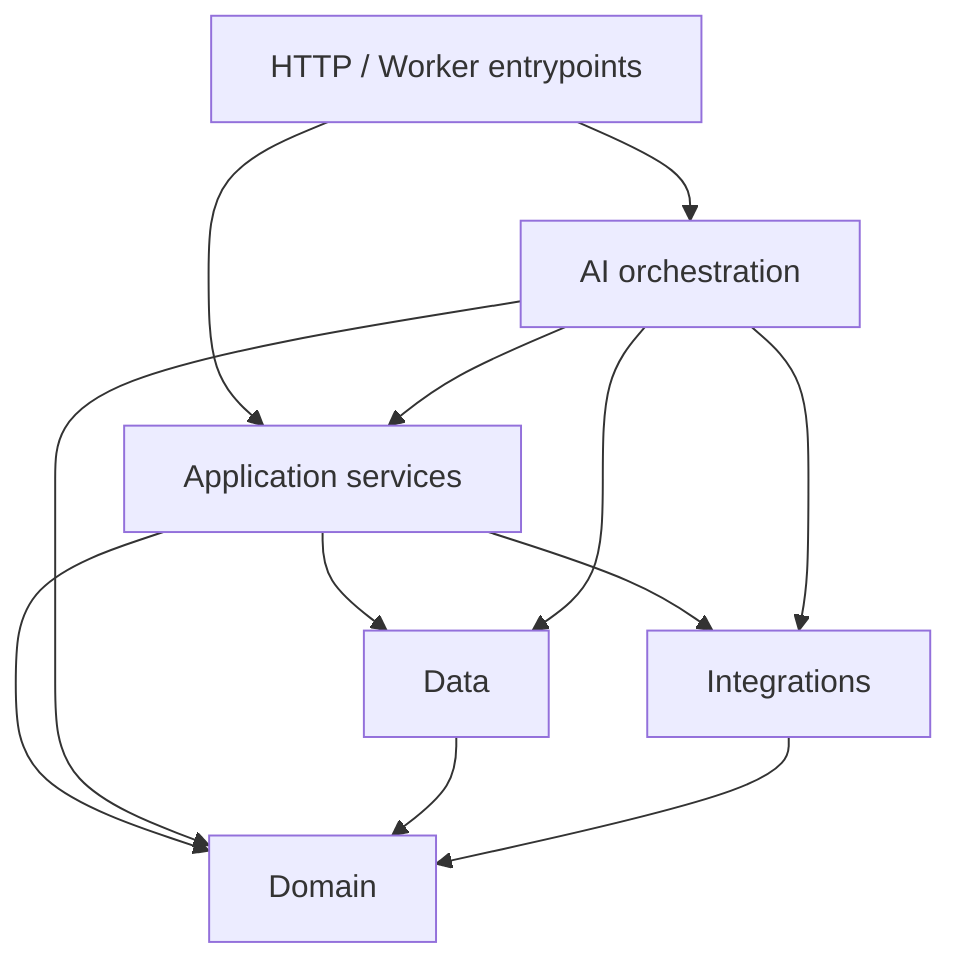
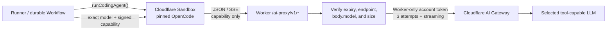

# Architecture

Turbodiff uses a small layered architecture. The layers are directories, not
framework abstractions: functions remain plain TypeScript and dependencies are
imported directly.

## Dependency direction

- `src/domain/` contains pure policy and value logic, including prompt
  security and AI Gateway model-capability checks. It does not import
  Cloudflare bindings, Hono, databases, or remote clients.
- `src/data/` contains PostgreSQL row types and queries. `db.ts` is a stable facade;
  implementations are grouped by responsibility so callers do not depend on a
  single query god-module.
- `src/integrations/` adapts external systems: GitHub, better-auth, MCP,
  notifications, and cryptography. Network protocol and capability-signing
  details stay here. The GitHub client owns authenticated JSON requests and
  bounded pagination; `security/ai-gateway-grant.ts` signs and verifies the
  model-scoped sandbox grant.
- `src/services/` implements application use cases and authorization policy.
  Services may coordinate data and integrations, but never accept or return
  Hono contexts. Factory producers enqueue the shared message contract through
  `factory-queue.ts` rather than reaching into a queue binding directly.
  `ai-gateway-proxy.ts` enforces the sandbox grant and coordinates the
  retried, streaming call to Cloudflare's AI REST API.
- `src/ai/` owns agent definitions, tools, sandbox runners, metering, dispatch,
  and durable Workflows. `runtime/` contains shared runner authentication,
  sandbox access, secret redaction, skill mounting, repository-workspace
  mechanics, and the shared OpenCode adapter. `coding-agent.ts` is the only
  CLI invocation seam; `coding-agent-output.ts` parses its JSONL event stream.
  `runners/` and `workflows/` keep stage orchestration explicit.
  HTTP routes enqueue or call these use cases; agent code does not own request
  authentication.
- `src/http/` owns request parsing, response serialization, middleware, and
  server-rendered pages. Routes should validate transport input and delegate
  decisions to services or AI use cases. The public AI and MCP proxy routes
  authenticate short-lived capabilities; they are not session-cookie APIs.
- `src/app.ts` and `src/cloudflare.ts` are composition roots only: they register
  providers and mount HTTP, queue, cron, Workflow, and Durable Object handlers.
- `src/shared/` contains serializable contracts shared across Worker, client,
  persistence, or AI boundaries.

## Boundary examples

The GitHub webhook route verifies the signature and parses JSON in
`src/http/webhooks.ts`. `src/services/github-webhooks.ts` decides what the
event means and schedules a review stage through `src/services/lifecycle.ts`;
when the stage command runs, `src/services/change-review.ts` applies the
dispatch policy (risk tier, push delta, agent selection from
`src/domain/review-selection.ts`) and `src/ai/review/dispatch.ts` admits and
dispatches the durable reviewer.

Connection rows and compare-and-set refresh claims live in
`src/data/connections.ts`. Credential decryption and OAuth refresh policy live
in `src/services/connections.ts`; protocol calls live in
`src/integrations/mcp/oauth.ts`. The non-secret connection contract lives in
`src/shared/connections.ts`, while its row-to-contract mapping belongs to the
service layer.

Factory queue payloads live in `src/shared/factory-messages.ts`. Producers use
`src/services/factory-queue.ts`; the composition root in `src/cloudflare.ts`
is the only place that routes the union to concrete runners and Workflows.

### Sandbox model-call boundary

The sandbox does not receive the permanent Cloudflare account token or a
provider API key. A runner selects a canonical model id and mints a two-hour
HMAC capability for that exact id. The model-neutral execution path is:

`src/ai/runtime/runner-auth.ts` owns model normalization, grant issuance, and
the locked-down OpenCode configuration. `src/http/ai-gateway-proxy.ts` is the
thin route adapter; `src/services/ai-gateway-proxy.ts` owns authorization and
upstream behavior. See [Sandbox coding harness](coding-harness.md) for the
full runtime contract, security properties, and rollout requirements.

### Hosted review workspace boundary

Hosted reviewers keep GitHub publication in narrow Worker tools, but can search
and validate an exact-head checkout in a separate Cloudflare Sandbox. The model
does not receive the sandbox's general shell: it gets a literal repository
search and the repository owner's preconfigured check command. A short-lived
read token exists only in the pull-ref fetch environment and is absent when
repository code runs. Per-agent worktrees prevent concurrent reviewers from
sharing mutable source state; the per-repository container still shares warm
package-manager caches. See [Review quality](review-quality.md) for the coverage
and finding-verification pipeline around this workspace.

## Adding functionality

1. Put pure rules and stable value types in `domain` or `shared`.
2. Add PostgreSQL queries to the matching `data` module and re-export them from
   `data/db.ts` when they are part of the data API.
3. Put external protocol details in `integrations`.
4. Coordinate the use case in `services` or `ai`.
5. Keep the HTTP/queue handler to parsing, authentication, delegation, and
   response mapping.

Avoid repository classes, dependency-injection containers, and one-interface-
per-function abstractions. Add an abstraction only when it creates a real
boundary, enables a test seam, or consolidates policy used by multiple entry
points.
