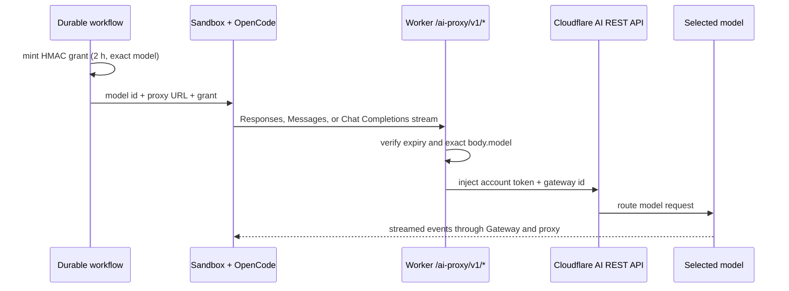

# Sandbox coding harness

## Decision

Turbodiff uses a pinned [OpenCode](https://opencode.ai/docs/cli/) CLI and its
[provider abstraction](https://opencode.ai/docs/providers/) as the model-facing
harness inside its Cloudflare Sandbox container. Model requests
are routed through Cloudflare's model-neutral
[AI REST API](https://developers.cloudflare.com/ai-gateway/usage/rest-api/),
so a runner can use any catalog LLM that supports streaming and tool calling.
The selected id is the canonical Cloudflare id: `provider/model` for a
third-party model or `@cf/author/model` for Workers AI.

This replaces Claude Code as the sandbox harness. Hosted PR reviewers still
use Flue and the Workers AI binding; this decision concerns only code-changing
and verification runs in `src/ai/runners/` and `src/ai/workflows/`.

The current runtime contract pins the Cloudflare Sandbox SDK and container to
`0.12.5` and OpenCode to `1.18.29`. Upgrade the SDK and `Dockerfile` base image
together; upgrade OpenCode only with the JSONL parser and multi-provider
canaries in the same change.

## Why OpenCode

The investigation compared the practical fit of four harnesses:

| Harness          | Strength                                                                                                        | Constraint for Turbodiff                                                                                                                     |
| ---------------- | --------------------------------------------------------------------------------------------------------------- | -------------------------------------------------------------------------------------------------------------------------------------------- |
| Claude Code      | Mature coding loop and strong Anthropic integration                                                             | Anthropic-native configuration and output make a cross-provider runner an adapter problem                                                    |
| OpenAI Codex CLI | Strong coding workflow and structured automation                                                                | Optimized around OpenAI models rather than a heterogeneous model catalog                                                                     |
| Pi               | Lightweight and model-flexible                                                                                  | Less suitable than OpenCode's current headless JSON/session/MCP surface for the existing durable workflows                                   |
| OpenCode         | Provider-neutral, headless JSON events, sessions, skills, MCP, and a first-class Cloudflare AI Gateway provider | Higher CLI cold-start overhead than Claude Code in a local `--version` smoke check; this is small relative to inference and repository setup |

OpenCode was selected because it minimizes custom harness code without tying
the factory to one model vendor. Its `run --format json` stream gives the
Worker explicit result, session, token, cache, and cost events. Its session id
can be resumed for repair turns, and its
[Agent Skills support](https://opencode.ai/docs/skills/) discovers the existing
`.claude/skills` mount as a compatible location. The exact version is pinned
in the container because those machine-readable contracts are part of our
runtime interface.

This decision is deliberately not a claim that one model is universally
fastest or best. Harness flexibility and model quality are separate concerns;
the deployment can now benchmark and change the model without replacing the
tool loop.

## Runtime path and security boundary

The Cloudflare account API token never enters the repository sandbox. The
sandbox gets a signed capability that expires after two hours and is accepted
only when `body.model` exactly matches the model encoded in the grant. The
proxy allows only the three LLM endpoints used by OpenCode, caps request bodies
at 16 MiB, applies three Gateway attempts with exponential backoff, and streams
the upstream response without buffering.

The grant is still a bearer capability. Runner logs redact it, and the proxy
does not forward it upstream. A compromised sandbox can spend against its one
authorized model until expiry, but it cannot extract the permanent account
token, switch models, access management APIs, or call non-LLM AI endpoints.

## Component ownership

| Concern                                                              | Owner                                           |
| -------------------------------------------------------------------- | ----------------------------------------------- |
| Canonical model normalization, grant minting, locked OpenCode config | `src/ai/runtime/runner-auth.ts`                 |
| One non-interactive CLI invocation shared by every sandbox stage     | `src/ai/runtime/coding-agent.ts`                |
| JSONL result, session, token, cache, and cost parsing                | `src/ai/runtime/coding-agent-output.ts`         |
| Pure exact-model request policy                                      | `src/domain/ai-gateway-policy.ts`               |
| HMAC capability format and expiry validation                         | `src/integrations/security/ai-gateway-grant.ts` |
| Endpoint, size, authorization, retry, and streaming behavior         | `src/services/ai-gateway-proxy.ts`              |
| Thin public route adapter                                            | `src/http/ai-gateway-proxy.ts`                  |

All stage runners call `runCodingAgent()`; none constructs an OpenCode command
or provider configuration independently. The command contract is
`opencode run --pure --auto --format json --model …`. Repository-owned
OpenCode config and plugins are disabled, while `AGENTS.md` instructions and
mounted skills remain available.

## Performance and reliability choices

- OpenCode is installed once in the sandbox image, not downloaded during a
  run. Its version is pinned, and the Sandbox base image exactly matches the
  resolved SDK version.
- Runs are non-interactive (`run --pure --auto --format json`) and reuse the
  warm per-repository sandbox and OpenCode session where the workflow permits.
- Automatic updates, model-list fetching, LSP downloads, terminal-title work,
  project configuration, and default plugins are disabled. This removes cold
  network work and prevents repository-owned harness code from executing.
- Prompts are passed through files rather than shell interpolation. The model
  and session id are passed through environment variables.
- Every `step_finish` event contributes to persisted usage, so multi-turn tool
  loops no longer undercount tokens or cost. A truncated final JSONL line is
  ignored while prior complete events remain usable.
- Cloudflare handles
  [retry/backoff](https://developers.cloudflare.com/ai-gateway/configuration/request-handling/)
  at the Gateway request boundary. Existing
  workflow timeouts, check commands, repair turns, durable retries, transcript
  persistence, and output redaction continue to provide higher-level recovery.
- OpenAI models use their native AI SDK adapter, Anthropic models use theirs,
  and other catalog LLMs use the OpenAI-compatible adapter against the same
  Cloudflare endpoint. All send the canonical Cloudflare model id unchanged.

## Model compatibility

"Any model" means any Cloudflare AI catalog **LLM with the capabilities a
coding agent needs**. Image, speech, embedding, and LLMs without reliable tool
calling are not viable code-runner models even though the wider AI REST API
can invoke them. Cloudflare also documents that the Anthropic Messages endpoint
does not support Workers AI models; OpenCode routes those models through the
OpenAI-compatible Chat Completions path instead.

The `app.models` table is the authoritative runner catalog shown by the UI.
Adding an enabled `for_runner` row makes that canonical id available without a
code or container change. Exactly one enabled runner must carry
`runner_default = true`, and exactly one must carry
`runner_fast_default = true`; the latter is used for cheap classification and
acceptance-proposal turns. They may be the same row. Missing roles or an empty
runner catalog produce an explicit service/configuration error—there is no
source-code model fallback. New tasks snapshot the current default so later
operator changes do not alter an in-flight task. Automations left on “Default”
resolve the current default when each scheduled run is claimed.

A migration qualifies existing bare Anthropic selections, canonicalizes the
former dated/hyphenated Fable and Haiku ids, and assigns the initial fast role.

OpenCode's runtime model-metadata fetch is disabled for deterministic startup.
A model newer than the pinned harness is still registered dynamically and can
run, but its locally calculated cost can remain zero until the image is bumped
to a release whose bundled catalog includes that model. Cloudflare Gateway
remains the authoritative source for billing and usage in that interval.

## Rollout and benchmark plan

Before enabling a new default in production:

1. Set `AI_GATEWAY_ACCOUNT_ID`, `AI_GATEWAY_ID`, and the Worker-only
   `AI_GATEWAY_API_TOKEN` (`Account / Workers AI / Read`). Configure Unified
   Billing for third-party models and ensure the account has sufficient
   credits. Remove credentials for retired harnesses from local and deployed
   secret stores; they are ignored and must not be substituted for the
   Cloudflare account token.
2. Apply migration `0016_runner-model-provider-prefix.sql`, build the Worker
   and sandbox image, then run one canary task per provider family.
3. Use a fixed corpus of representative small fixes, cross-file features,
   dependency changes, test failures, and merge conflicts. Run each candidate
   at least three times to expose variance.
4. Compare end-to-end wall time, successful check rate, first-pass success,
   repair turns, stalled/failed runs, input/output/cache tokens, and cost. Treat
   malformed tool use and unauthorized file changes as correctness failures,
   not merely slower runs.
5. Promote a model only after its check-pass and stability rates meet or beat
   the current default. Keep a smaller model for proposal/classification work
   only when it does not lower decision accuracy.

The repository test suite validates event parsing, grant forgery/expiry,
model-scope enforcement, credential exchange, response streaming, types, and
database migration structure. A live multi-provider benchmark is intentionally
an operational canary because it consumes paid inference and requires the
deployment's real Gateway configuration.
