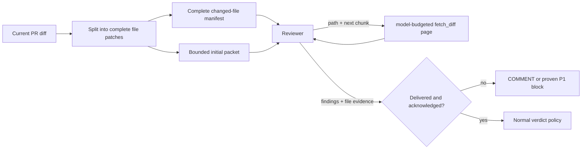
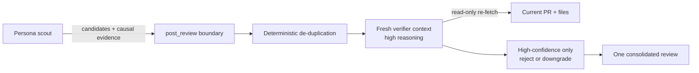
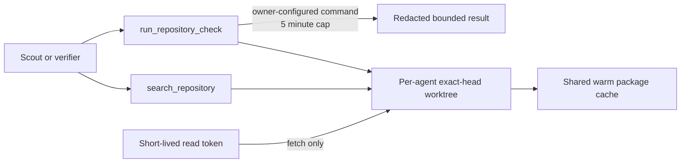

# Review quality

Turbodiff optimizes review quality for signal, not comment volume. A review
must cover the whole change, prove each reported defect against repository
context, and publish only findings that are actionable at the stated severity.

## Context and coverage

GitHub's unified diff is split on file boundaries before it enters model
context. `fetch_pr` returns two complementary artifacts:

- a complete manifest of every changed path, including whether generated or
  noisy files were deliberately excluded; and
- an initial model-budgeted packet containing only complete patches.

The reviewer retrieves each `remainingFiles` path with paged `fetch_diff`
calls until `nextChunk` is null. The packet budget comes from the selected
model's operator-managed catalog metadata (64k diff tokens by default, about
192k characters), rather than one global 120k-character ceiling. Oversized
single-file patches are split at line boundaries with explicit old/new line
counters, so they no longer become permanently unreviewable. Every returned
chunk is recorded against the exact review run; all expected chunks must be
present before the patch is considered delivered. At publication the reviewer
submits a per-file acknowledgement: `reviewed` with a code-specific evidence
summary, or `blocked` with the concrete limitation. A path counts as covered
only when both the server-observed patch delivery and the acknowledgement are
present. A partial review may comment or block on a proven P1, but can never
approve.



## Precision contract

Full-risk reviews use a high reasoning budget; lighter tiers still retain a
medium budget. Before publishing, the reviewer must try to disprove each
candidate by tracing reachable callers, guards, competing state writers, and
the concrete impact. P1 requires all of the following:

- a reachable execution path;
- explicit preconditions; and
- concrete merge-blocking damage.

Telemetry gaps, optional hardening, maintainability suggestions, unsupported
external API assumptions, and style preferences are not P1. P3 findings are
discarded rather than posted.

## Independent verification and publication

The scout model cannot publish a raw finding. `post_review` is a harness-backed
publication boundary: it de-duplicates the candidate batch, then opens a fresh
model operation instructed to use dedicated, repository-pinned read-only fetch
tools. That verifier re-fetches the live change and tries to disprove every
candidate against its anchor, guards, callers, preconditions, and claimed
impact. Candidate JSON is explicitly treated as untrusted data.

Only high-confidence acceptances are published. A verifier may reject or
downgrade a finding but cannot promote P2 to P1. Missing or duplicate decisions
fail closed. If the verification operation itself fails, all candidates are
withheld and the review is forced to `COMMENT`; it cannot accidentally approve
or request changes from unverified output. The publisher then emits one
consolidated GitHub review with the retained inline comments.

When every required reviewer in the lifecycle stage settles, Turbodiff also
publishes a head-SHA-bound `Turbodiff / Review readiness` Check Run. Its
conclusion is successful only when every dispatched reviewer completed with
full evidence and no P1 conclusion. Missing evidence, a failed reviewer, a
stale head, or a blocking finding produces a failing check with per-reviewer
coverage and diagnostic detail. Re-runs on the same head update the same
logical check. Both lifecycle merges and legacy factory auto-merge consult the
persisted stage result directly, so an absent or delayed GitHub check cannot
accidentally weaken the internal gate.



## Repository workspace

Hosted GitHub reviews can inspect a full checkout without receiving a general
shell. `search_repository` performs a literal, line-numbered `git grep` across
the exact PR head and caps the response. `run_repository_check` can execute
only the repository owner's stored check command; the model cannot provide a
command string. Both tools remain pinned to the dispatched repository and SHA.

Review checkouts use a dedicated per-repository Cloudflare Sandbox container,
separate from the repository-changing factory workspace. Each durable agent
gets its own worktree, while dependency caches remain warm across the repo.
The checkout fetches same-repository and fork PRs through GitHub's pull ref
with a short-lived read token supplied only to that command. No credential is
stored in `.git/config` or exposed to the model/check process. Refreshes are
serialized, reset tracked changes, and remove untracked outputs before reuse.

The configured check runs with no repository credential and a five-minute
limit. Dependency installation is cached, output is capped and redacted, and
the source worktree is reset afterward. This is a validation aid, not a CI
replacement; the normal GitHub checks remain authoritative.



## Feedback and quality telemetry

Every candidate and verifier decision is persisted in `review_findings`,
including private evidence, causal path, confidence, downgrade/rejection
reason, and whether it was published. Review rows separately record verifier
model, input/output tokens, cost, latency, status, and experiment assignment.
This keeps scout spend and verification overhead attributable without adding
verifier tokens twice to total review metering.

The signed-in **Quality** page is a finding inbox. Maintainers label published
findings as `useful`, `false_positive`, `fixed`, or `dismissed`; updates are
authorized through the review's installation, and only published findings can
be labeled. The 30-day dashboard reports labeled precision, verifier retention,
latency, and cost. `useful` and `fixed` are positive labels;
`false_positive` is negative; `dismissed` remains neutral because a valid
finding can be intentionally deferred.

## Regression evals

`vp run test:review-evals` validates the scoring and rollout-gate implementation
against adversarial cases: false alarms, missed findings, duplicate comments,
and P1 findings reported at the wrong severity. The rollout gate requires:

- precision at least 90%;
- recall at least 80%;
- P1 precision at least 95%; and
- P1 recall at least 90%.

New production false-positive labels should be reduced to the smallest
self-contained code/context fixture and added to the corpus. Before changing a
prompt or model, run both variants against that corpus and pass their captured
outputs to `scoreReviewEval`. CI deliberately does not hard-code
`actual === expected` or claim that a static fixture exercised a live model;
the scorer is the deterministic gate used by a separate model-evaluation run.
This makes “sounds better” measurable without turning a self-fulfilling unit
test into coverage theater, and prevents a new model from buying recall with
noisy or duplicated findings.

## Controlled model experiments

The operator-managed `app.models` catalog has independent
`reviewer_experiment_weight` and `verifier_experiment_weight` columns. Zero is
off. Positive weights opt enabled reviewer models into deterministic weighted
assignment; scout and verifier use independent buckets. The assignment key is
stable for repository, PR head, and persona, so retries do not jump variants.
The exact pair is persisted with the review for labeled comparison.

For example, this runs an equal verifier split while leaving scout selection
unchanged:

```sql
UPDATE app.models
SET verifier_experiment_weight = CASE
  WHEN provider = 'anthropic' AND model_id = 'claude-sonnet-5' THEN 1
  WHEN provider = 'openai' AND model_id = 'gpt-5.6-terra' THEN 1
  ELSE 0
END
WHERE for_reviewer;
```

Set both weight columns back to zero to stop an experiment immediately. A
promotion remains an explicit operator action (`reviewer_default` or persona
configuration); experiments never rewrite catalog defaults.
