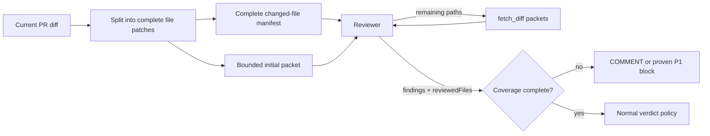
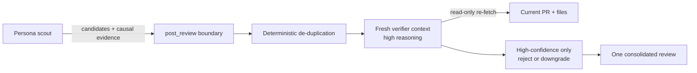

# Review quality

Turbodiff optimizes review quality for signal, not comment volume. A review
must cover the whole change, prove each reported defect against repository
context, and publish only findings that are actionable at the stated severity.

## Context and coverage

GitHub's unified diff is split on file boundaries before it enters model
context. `fetch_pr` returns two complementary artifacts:

- a complete manifest of every changed path, including whether generated or
  noisy files were deliberately excluded; and
- an initial size-bounded packet containing only complete patches.

The reviewer retrieves `remainingFiles` with `fetch_diff`. It passes every
inspected path to `post_review`, which independently re-fetches the live diff
and enforces the coverage claim. A partial review may comment or block on a
proven P1, but can never approve. This makes context loss visible instead of
silently treating the first 120,000 characters as the whole pull request.

## Precision contract

Full-risk reviews use a high reasoning budget; lighter tiers still retain a
medium budget. Before publishing, the reviewer must try to disprove each
candidate by tracing reachable callers, guards, competing state writers, and
the concrete impact. P1 requires all of the following:

- a reachable execution path;
- explicit preconditions; and
- concrete merge-blocking damage.

Telemetry gaps, optional hardening, maintainability suggestions, unsupported
external API assumptions, and style preferences are not P1. P3 findings are
discarded rather than posted.

## Independent verification and publication

The scout model cannot publish a raw finding. `post_review` is a harness-backed
publication boundary: it de-duplicates the candidate batch, then opens a fresh
model operation instructed to use dedicated, repository-pinned read-only fetch
tools. That verifier re-fetches the live change and tries to disprove every
candidate against its anchor, guards, callers, preconditions, and claimed
impact. Candidate JSON is explicitly treated as untrusted data.

Only high-confidence acceptances are published. A verifier may reject or
downgrade a finding but cannot promote P2 to P1. Missing or duplicate decisions
fail closed. If the verification operation itself fails, all candidates are
withheld and the review is forced to `COMMENT`; it cannot accidentally approve
or request changes from unverified output. The publisher then emits one
consolidated GitHub review with the retained inline comments.

The next layers build on this contract: read-only repository workspaces for
search and tests, then labeled feedback, regression evals, and controlled model
experiments.
