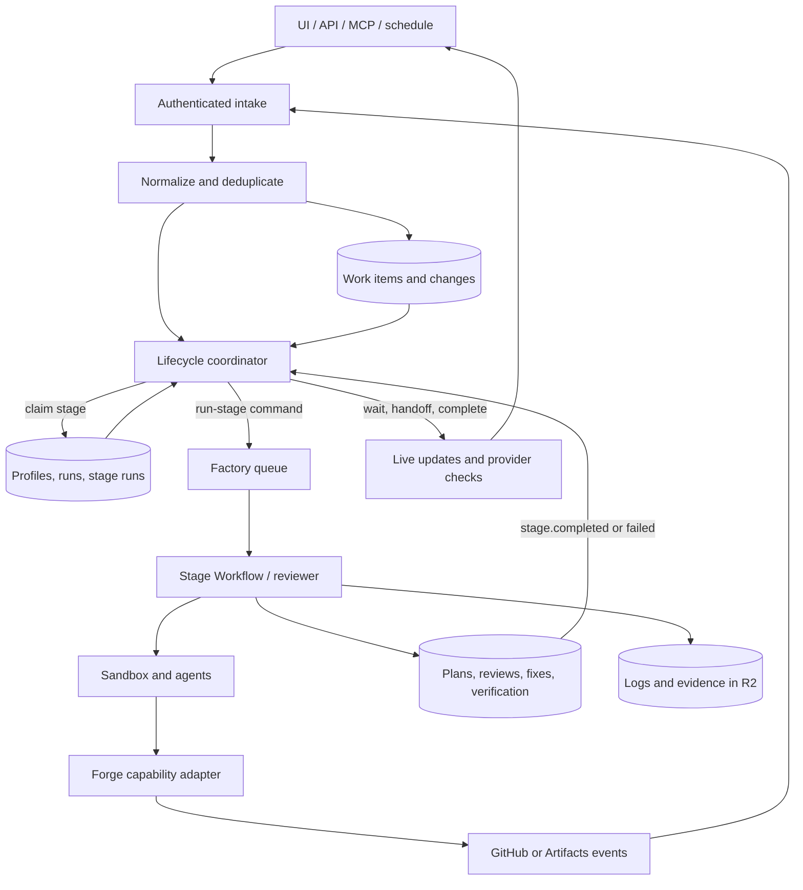

# Composable software factory lifecycle

Status: normative implementation specification

Turbodiff is a composable software factory. A team may delegate any contiguous
portion of the software delivery lifecycle to it: idea to pull request, pull
request to reviewed change, reviewed change to verified change, or the full
path to merge. The factory must fit the team's process rather than requiring
the team to adopt Turbodiff's process.

This document defines the target domain model, lifecycle contracts, policy
semantics, event flow, compatibility requirements, and acceptance scenarios.
The scenario ids are stable references shared with
`src/domain/lifecycle-contract.test.ts`.

## Product invariants

1. A stage does not depend on Turbodiff having run an earlier stage. It depends
   only on valid input artifacts, an authorized change, and a run policy.
2. A run has an explicit start stage and stop boundary. Reaching the stop
   boundary is a successful handoff, not an incomplete run.
3. Stage executors record outcomes. Only the lifecycle coordinator decides what
   happens next.
4. Provider events are normalized before business policy sees them.
5. Repository defaults may configure a run, but the run snapshots the process
   selected for it. A live repository kill switch and live permission checks
   always override a snapshot.
6. Read-only stages must remain usable when write or merge capabilities are
   absent. A fork pull request can be reviewed even when it cannot be repaired.
7. Turbodiff merge readiness composes with external CI, approvals, branch
   protection, and merge queues. It never substitutes for them.
8. Duplicate events, queue deliveries, and Workflow resumptions must not
   duplicate paid work or provider mutations.
9. Existing repositories retain their current factory-only behavior until an
   administrator explicitly selects a new process profile.

## Lifecycle stages

| Stage       | Required input                       | Durable output                         |
| ----------- | ------------------------------------ | -------------------------------------- |
| `plan`      | Work item and repository context     | Plan and versioned acceptance contract |
| `implement` | Approved specification or plan       | Branch and committed head SHA          |
| `publish`   | Implemented branch                   | Provider-neutral change                |
| `review`    | Reviewable change                    | Review verdict and findings            |
| `repair`    | Writable change and findings         | Updated change head or handoff         |
| `verify`    | Change and acceptance contract       | Evidence and verification verdict      |
| `merge`     | Mergeable change and satisfied gates | Merged provider state                  |

`repair` may loop back into `review` and `verify`. Conflict resolution and
interactive chat are repair triggers, not separate lifecycle stages.

## Domain objects

### Work item

The user or system intent behind a change. Its origin is one of `idea`, `issue`,
`external_change`, `automation`, or `api`. A work item may exist without a plan
and may link to more than one repository or change.

### Change

The provider-neutral identity of a branch comparison, GitHub pull request, or
native change request. It records repository, provider key, display number,
source and target refs/heads, state, URL, origin, and observed capabilities.
Review, repair, verification, cockpit, conflict, and merge operations address a
change id rather than a feature id or a provider-specific number.

### Factory run

A specific delegation of responsibility. It records the work item and optional
change, selected profile, start stage, stop-after stage, policy snapshot,
trigger, actor, status, and handoff metadata.

Run statuses are:

- `active`: the coordinator may schedule work.
- `awaiting_human`: an approval or decision is required.
- `handed_off`: the requested stop boundary or a safe capability boundary was
  reached successfully.
- `completed`: the selected lifecycle completed inside Turbodiff.
- `failed`: an unrecoverable stage failure exhausted policy.
- `cancelled`: an authorized actor stopped the run.

### Stage run

One claimed attempt at one lifecycle stage. It records stage, attempt, status,
trigger, input/output references, Workflow instance, usage, error, timestamps,
and an idempotency key. Stage-specific tables such as plans, reviews, fix
attempts, and verifications remain the source of their rich results and link to
the stage run.

### Acceptance contract

A versioned list of empirically checkable criteria attached to a work item or
change. It may originate from planning, direct user input, a PR description, or
an external issue. A verification records the exact contract version it used.

### Process profile

A named repository or organization default defining stage modes, approvals,
retry limits, and intake filters. The initial built-in profiles are:

| Key                 | Behavior                                              |
| ------------------- | ----------------------------------------------------- |
| `review_on_demand`  | Existing change to one requested review               |
| `automatic_review`  | Qualifying opened/updated changes are reviewed        |
| `review_and_repair` | Review and repair until clean or handed off           |
| `idea_to_pr`        | Plan, implement, and publish; stop at the open change |
| `assisted_delivery` | Plan through verified change; human merges            |
| `full_delivery`     | Plan through merge when every gate permits it         |
| `native_turnkey`    | Full delivery using the Turbodiff-hosted forge        |
| `legacy_factory`    | Compatibility behavior for existing repositories      |

Each stage is `disabled`, `on_demand`, or `automatic`. A stage may additionally
require human approval. Intake filters may inspect provider, origin, draft
state, base branch, labels, paths, and author type.

## Commands and events

Provider transports emit normalized lifecycle events. The coordinator consumes
events and writes the next stage claim transactionally. The queue carries only
commands for already-claimed stage runs.

Required normalized events:

- `work.requested`
- `plan.ready`
- `human.approved`
- `change.opened`
- `change.updated`
- `change.closed`
- `stage.completed`
- `stage.failed`
- `external.checks_updated`
- `human.resume_requested`
- `human.handoff_requested`
- `run.cancelled`

A stage command includes `factoryRunId`, `stageRunId`, `stage`, `changeId` when
applicable, and `idempotencyKey`. Consumers reject a command whose stage run is
not in a claimable state.

## Coordinator decisions

For every event the coordinator produces exactly one of:

- `schedule(stage)`: create/claim a stage run and enqueue it.
- `wait(reason)`: persist `awaiting_human`; enqueue nothing.
- `handoff(reason)`: persist a successful handoff; enqueue nothing.
- `complete`: persist completion; enqueue nothing.
- `ignore(reason)`: make no lifecycle mutation beyond event deduplication.

The coordinator evaluates, in order:

1. event deduplication and current run terminality;
2. repository kill switch and live authorization;
3. required input artifacts and provider capabilities;
4. stop boundary;
5. selected stage mode and approval gate;
6. retry/loop policy;
7. external readiness facts for merge.

## Provider capabilities

Stages query capabilities instead of branching on provider names:

- `read_change`
- `publish_review`
- `write_head`
- `publish_check`
- `merge`
- `merge_queue`

Repository transport (clone/fetch/push credentials) remains separate from forge
behavior (changes, reviews, checks, comments, and merge). Missing capabilities
cause a safe skip, wait, or handoff according to profile; they do not invalidate
unrelated stages.

## Merge readiness

Readiness evaluation is pure and separate from merge execution. Automatic merge
requires all configured gates to be satisfied at the current change head:

- no merge conflict;
- required Turbodiff review completed without a blocking verdict;
- required verification passed against the current head and contract version;
- external checks are green;
- required provider approvals are present;
- branch protection allows the selected merge mechanism;
- the actor/provider has `merge` or `merge_queue` capability.

Unknown or stale facts decline automatic merge and leave the change open.

## Data flow

## Migration and compatibility

1. Add canonical change, run, stage-run, profile, and acceptance-contract data
   without removing current feature/PR fields.
2. Dual-write factory-generated GitHub PRs and native CRs into canonical
   changes. Webhooks backfill human GitHub PRs on demand.
3. Represent existing behavior as `legacy_factory`; existing repositories are
   assigned it automatically.
4. Move one stage at a time behind the coordinator. During migration, a stage
   has exactly one scheduling owner; direct and coordinator scheduling must
   never be enabled simultaneously.
5. Move cockpit reads to changes, keep legacy feature routes as redirects, and
   validate dual reads.
6. Migrate automations to normal work items/runs.
7. Remove redundant feature PR fields and origin guards only after backfill and
   parity checks pass.

## Acceptance scenario groups

- `REV`: review intake, re-review, and review-only behavior.
- `RUN`: orchestration, deduplication, retry, and terminal-state behavior.
- `HND`: stop boundaries, wait states, handoff, and resume.
- `CAP`: capability degradation and authorization.
- `VER`: acceptance contracts and verification loops.
- `MRG`: external gates and merge readiness.
- `CMP`: compatibility and migration behavior.

The test fixture is the executable inventory. A scenario becomes enforced by
the policy implementation in the stack layer that delivers it; normal CI must
remain green in every intermediate PR.

## Non-goals for the first stack

- A visual workflow/DAG editor.
- Arbitrary user-defined stage types.
- GitLab or Bitbucket support before GitHub partial-adoption paths are proven.
- Replacing the current agent prompts, sandbox runtime, or native CR engine.
- Bypassing provider branch protection or human approval requirements.
